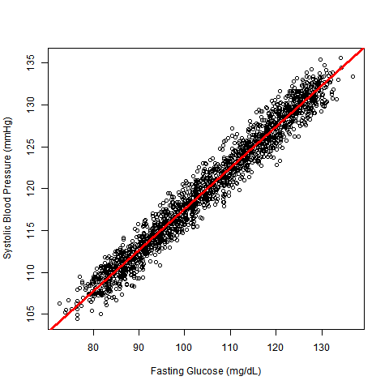
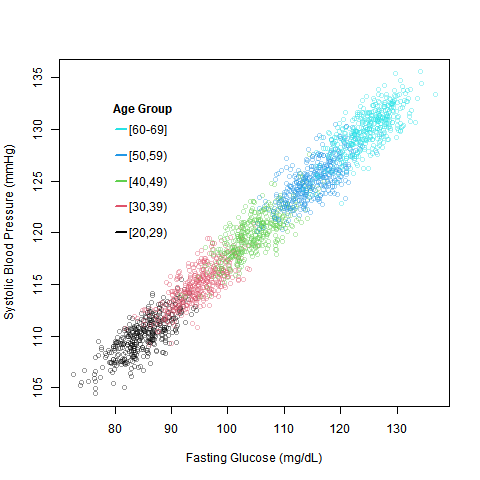
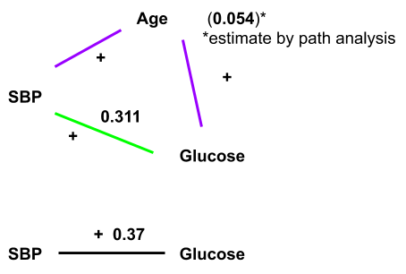

<!-- This video is part 2 of the lecture on the basic model of multiple linear
regression. -->

## Example 2: Systolic Blood Pressure and Glucose

Hypothesis:
```
a high level of blood sugar tends to raise blood pressure.
```

With cross-sectional data including these two variables, what would you do
first (after plotting)?

$Y = A + B_{2}X_{2} + E$

$Y$: systolic blood pressure (mmHg)

$X_{2}$: serum glucose (mg/dL)

<!-- Let's look at another example, which shows that, multiple linear
regression can be used to better understand relationships among variables. In
the previous session, we investigated a hypothesis on (age variation in
systolic blood pressure). In this example, we start with (a hypothesis about
the relationship between blood sugar and blood pressure). Suppose that, for
some reason, we think that (a high level of blood sugar) should raise the level
of blood pressure. If we have cross-sectional data that includes systolic blood
pressure and serum glucose, we will probably start with plotting blood pressure
against serum glucose, and then we may do linear regression of blood pressure
on serum glucose. The regression model should look like this. Here, Y is
systolic blood pressure, and x2 is serum glucose. (A) and B-2 are parameters to
be estimated from data. -->

## Regression Result

```{r,echo=FALSE,results='hide'}
library(NHANES)
data(NHANES)
glux <- readRDS("../data/glu_f.rds")
nhmerge <- merge(NHANES, glux, by.x = "ID", by.y = "seqn")
miniH <- nhmerge[nhmerge$Age >= 20 & nhmerge$Age <= 64 & nhmerge$lbxglu <= 130,
    c("Age", "BPSysAve", "lbxglu")]
fit1 <- lm(BPSysAve ~ lbxglu, data = miniH)
summary(fit1)
vals <- round(coef(fit1), 2)
```

$\hat{Y} = `r vals[[1]]` + `r vals[[2]]`X_{2}$

$Y$: systolic blood pressure (mmHg)

$X_{2}$: serum glucose (mg/dL)

For ages 20-64 in NHANES 2009-2010

<!-- This is the result of the regression analysis using the N-hanes data on
persons aged 20 to 64. According to this regression model, systolic blood
pressure is predicted as 80.55, + 0.37 times x2, which is serum glucose. -->

## Question

So `r vals[[2]]` represents a typical relation between serum glucose and SBP in
the data. But we know that SBP is strongly associated with age. And serum
glucose may be related to age as well. Then, how is SBP related to serum
glucose _among people at the same age_?

<!-- The value of the regression coefficient, 0.37, means that in the data, on
average, or typically, (an increase of systolic blood pressure by 0.37
millimeters of mercury) corresponds to a unit increase of serum glucose, i.e.,
(an increase of serum glucose by 1 milligram per deciliter). This indicates a
positive correlation between systolic blood pressure and serum glucose. But we
saw (in session 1) that, systolic blood pressure is strongly associated with
age. And serum glucose may be related to age as well. So, although the data
show a positive correlation between systolic blood pressure and serum glucose,
the correlation may be partly due to the combination of their relations to age.
Then, the next question is, how is systolic blood pressure related to serum
glucose, among people at the same age? -->

## How do we estimate the relation between serum glucose and SBP among people at the same age? {.smaller}

1. Do regression of SBP on serum glucose for those aged 25, for those aged 26,
...
    * A huge sample is needed
    * Results need to be summarized
2. Do regression of SBP on serum glucose for those in the 20s, for those in the
30s, ...
    * That is a crude control of age
3. Do regression of SBP on serum glucose and age. (Set up a model that has a
parameter indicating age-adjusted relation between serum glucose and SBP and
then fit the model to the data.)

<!-- There are several ways to estimate the relation between systolic blood
pressure and serum glucose (among people at the same age). First, we can do
(regression of systolic blood pressure on serum glucose) for those aged 25, for
example, and the same regression analysis again for those aged 26, and then
another for those aged 27, and so on. But in this way, we will have to do many
regression analyses. So we need a huge sample. Also, we get a regression result
for those aged 25, another result for those aged 26, another for those aged 27,
and so on. So we will end up with many estimates of the regression coefficient,
which need to be summarized using a proper statistical procedure.  Second, we
can adopt wider age intervals such as ten-year age groups, and do the
regression analysis for those in the 20s, another regression for those in the
30s, and another for those in the 40s, and so on. This requires a smaller
sample, but we still need a fairly large sample, because we need to do
regression for each of several ten-year age groups. Also we are controlling for
age in a more crude way than before, because in this approach, age variations
within each ten-year age group are ignored. But age differences within each
ten-year age group may have some effect. For example, those aged 59 may tend to
have higher levels of systolic blood pressure and serum glucose than those aged
50. In addition, we still have to statistically summarize (different estimates
of the regression coefficient for the ten-year age groups).  Thirdly, we can do
multiple linear regression of systolic blood pressure on serum glucose and age.
The regression model has a parameter, the partial regression coefficient for
serum glucose, which summarizes (age-adjusted relation between serum glucose
and systolic blood pressure). This is a practical and convenient way, which
does not require a very large sample, and produces just one parameter estimate
summarizing (age-controlled relation between serum glucose and systolic blood
pressure). -->

## Model 1 and 2

<div class="columns-2">
Model 1: $Y = A + B_{2}X_{2} + E$

Model 2: $Y = A + B_{1}X_{1} + B_{2}X_{2} + E$
</div>

$Y$: systolic blood pressure

$X_{1}$: age

$X_{2}$: serum glucose (mg/dL)

Model 2 estimates that on average, a unit difference in serum glucose is
associated with a difference in SBP by $B_{2}$, _holding age constant_.

<!-- This slide shows two regression models of systolic blood pressure. Model
one is regression of systolic blood pressure on serum glucose only, and model
two is regression of systolic blood pressure on age and serum glucose. In model
two, a unit difference in serum glucose is associated with a difference in
systolic blood pressure by B-two, holding age constant.  This phrase, 'holding
age constant', can be interpreted as follows. According to the model-2
equation, when the value of x-2 increases by one, then y increases by b-2. But
it is so, as far as x1 remains unchanged. Suppose that the value of x-1 changes
when the value of x-2 changes. Then, when the value of x-2 increases by one,
the corresponding change in 'y' may not be b-2. Again, if x-2 increases by one,
'y' increases by b-1, as far as x-1 remains constant.  What about the last term
in model two, E? It is assumed to represent some random variations, the mean
value of which is zero. So when x-2 increases by one, the corresponding
increase in "y", may be greater than b2, if E is positive, or smaller than b2,
if E is negative. But on average, the increase in 'y', should be b2, according
to model two.  We study about E, more (in session 5).  This is an intuitive
explanation. There is a more mathematical explanation, which we will study in a
later session. -->

## Three models


```{r,echo=FALSE,results="hide"}
ageFit <- lm(BPSysAve ~ Age, data = miniH)
summary(ageFit)
agevals <- round(coef(ageFit), 2)
allFit <- lm(BPSysAve ~ Age + lbxglu, data = miniH)
summary(allFit)
allvals <- round(coef(allFit), 2)
```

$\hat{Y} = `r agevals[[1]]` + `r agevals[[2]]`X_{1}$

$\hat{Y} = `r vals[[1]]` + `r vals[[2]]`X_{2}$

$\hat{Y} = `r allvals[[1]]` + `r allvals[[2]]`X_{1} +  `r allvals[[3]]`X_{2}$

$Y$: systolic blood pressure (mmHg)

$X_{1}$: age (years)

$X_{2}$: serum glucose (mg/dL)

<!-- This slide shows results of three regression analyses of systolic blood
pressure. The first is on age only, the second is on serum glucose only, and
the third is on age and serum glucose together. Note that (the regression
coefficient for serum glucose) became smaller from 0.37 to 0.31, by
incorporating age into the model. -->

## Visual Illustration

Why did beta for glucose change when age was included in the regression
equation?

Beta in simple regression of SBP on SG

Age [20,64]: `r vals[[2]]`

```{r,echo=FALSE,results="hide"}
res <- sapply(split(miniH, Hmisc::cut2(miniH$Age, g = 3)), function(x) {
    fit <- lm(BPSysAve ~ lbxglu, data = x)
    round(coef(fit)[[2]], 2)
})
```

Age `r names(res)[[1]]`: `r res[[1]]`

Age `r names(res)[[2]]`: `r res[[2]]`

Age `r names(res)[[3]]`: `r res[[3]]`

Explanation of mechanism using simulated data

<!-- Why did the coefficient for serum glucose, decrease from 0.37 to 0.31,
when age was included in the regression equation? In order to explore this
question, I did three more simple regression analyses of systolic blood
pressure on serum glucose. The estimated regression coefficient was 0.37 for
the broad age range from 20 to 64. I split the age range, into three narrower
age ranges of 20 to 34, 34 to 49, and 49 to 64, and obtained an estimate of the
coefficient for each of the ranges. We may expect that 0.37 should be like an
average of the estimated coefficients for the three narrower age groups. But
actually, as shown here, all of the three estimated coefficients were lower
than 0.37. What was happening? Let's explore, using simulated data. -->

## Simulated Regression



<!-- This shows systolic blood pressure by serum glucose in the simulated data.
For visual clarity, their correlation was made stronger than it actually was.
The red line is the regression-line fitted to all points in the graph. -->

## With groups



<!-- Now let's introduce age into the graph. The black points indicate
respondents who are in the 20s, the red points indicate those in the 30s, the
green points in the 40s, the blue points in the 50s, and the light blue points
in the 60s. We see that the five clusters of points are at different locations
in this graph.  This figure shows systolic blood pressure and serum glucose are
associated with age. Systolic blood pressure is associated with age. For
example, the cluster of the light blue points are at a higher position than the
cluster of blue points, indicating that those in the 60s tend to have higher
blood pressure tnan those in the 50s. The cluster of the green points are at a
higher position than the cluster of the red points, indicating those in the 40s
tend to have higher blood pressure than those in the 30s. Serum glucose is
associated with age as well. The cluster of the light blue points are on the
right of the cluster of blue points, indicating those in the 60s tend to have
higher levels of serum glucose than those in the 50s. The cluster of the red
points are on the right of the cluster of the black points, indicating those in
the 30s tend to have higher levels of serum glucose than those in the 20s. -->

## With group fits


<!-- Here, a straight-line is fitted to points of each color, indicating that
systolic blood pressure and serum glucose are positively correlated in each of
the five age groups. But the slopes of these lines are flatter than the slope
of the straight-line fitted to all of the points, which we saw two slides
before. This suggests that when the relation between systolic blood pressure
and serum glucose is adjusted for age, their relation is not so strong as their
relation not adjusted for age. -->

## Controlling for Age

```{r,echo=FALSE,results="hide",message=FALSE,warning=FALSE}
mediation <- '
BPSysAve ~ cp*lbxglu + b*Age
Age ~ a*lbxglu
ab := a*b
total := a*b + cp
'
library(lavaan)
res <- sem(mediation, data = miniH)
summary(res)
```



<!-- The simulated example and this schematic presentation help us to
understand why (the value of regression coefficient for serum glucose) became
smaller when age was included in the regression model. The black line
represents the bivariate relation between systolic blood pressure and serum
glucose. On average, (an increase in systolic blood pressure by 0.37)
corresponds to (a unit increase in serum glucose). But this relation is partly
due to age, because systolic blood pressure is positively related to age, and
serum glucose is positively related to age as well. So (the relation between
systolic blood pressure and serum glucose) can be split into two kinds of
relationships, their relation with each other among people at the same age,
which may be called their age-adjusted or age-controlled relation, and (their
relation with each other) resulting from the fact that both of them are related
to age. These two relationships are represented by the green line, and the
purple lines, respectively. As shown in a previous slide, (the regression
analysis of systolic blood pressure on serum glucose and age) indicated that,
among the people at the same age, on average, an increase in systolic blood
pressure by 0.31, corresponds to a unit increase in serum glucose. A special
statistical method called path analysis shows that through age, an increase in
systolic blood pressure by 0.054, corresponds to a unit increase in serum
glucose. Therefore, the simple regression coefficient for serum glucose, 0.37,
is decomposed as 0.31, representing the age-adjusted association between
systolic blood pressure and serum glucose, +0.054, representing their
association through age.  So this example illustrates how linear regression is
used for understanding relationships among three or more variables. -->

## Terminology

$\hat{Y} = A + B_{1}X_{1} + B_{2}X_{2}$

$Y = A + B_{1}X_{1} + B_{2}X_{2} + E$

$A$: the value of \hat{Y} when $X_{1} = 0$ & $X_{2} = 0$

$B_{1}$: difference in \hat{Y} associated with a unit difference in $X_{1}$ when
$X_{2}$ is fixed

$B_{2}$: difference in \hat{Y} associated with a unit difference in $X_{2}$ when
$X_{1}$ is fixed

<!-- A few words on the terminology and notations may be of help. This slide
shows a model of linear regression with two independent variables, X1 and X2.
The upper equation is for the predicted value of the dependent variable, Y-hat,
and the lower equation is for the observed value of the dependent variable, Y.
(A) is the estimated mean value of Y, when both X1 and X2 are zero. B-1 is the
expected difference in Y, associated with a unit difference in X1, when X2 is
fixed. B-2 is the expected difference in Y, associated with a unit difference
in X2 when X1 is fixed.  By the way, you may have noticed that so far, in some
slides, alpha, beta, and epsilon were used, and in other slides, 'A', B, and
(E) were used. Actually the distinction had some meanings, but the distinction
is not important in this session. It will become more relevant in sessions four
and five. -->

## In Multiple Linear Regression...

$B$s are called:

* partial regression coefficient
* beta coefficient
* slope coefficient
* regression weight

<!-- Different papers and textbooks use different names for 'B', in the linear
regression model, such as partial regression coefficient, beta coefficient,
slope coefficient, regression weight, and so on. Basically these have the same
meaning. -->

## Describing B1

$Y = A + B_{1}X_{1} + B_{2}X_{2} + E$

$B_{1}$ ...

* controlling for $X_{2}$
* adjusting for $X_{2}$
* holding $X_{2}$ constant

<!-- Also, different phrases are used, when the partial regression coefficient
is interpreted. Here, B-1 summarizes the relation between y and X1, controlling
for X2, or adjusted for X2, or holding X2 constant. These phrases have
essentially the same meaning. -->

## Three or more Independent Variables

$Y = A + B_{1}X_{1} + B_{2}X_{2} + E$

$Y = A + B_{1}X_{1} + B_{2}X_{2} + \dots + B_{k}X_{k} + E$

<!-- So far, we have been studying linear regression with two independent
variables, X1 and X2 here. The model can be easily extended to three or more
independent variables, by adding B3 times X3, B4 times X4, and so on. -->

## Why 'linear regression'?

Two $X$s: $Y = A + B_{1}X_{1} + B_{2}X_{2} + E$

3 or more $X$s: $Y = A + B_{1}X_{1} + B_{2}X_{2} + \dots + B_{k}X_{k} + E$

Predicted Y: $\hat{Y} = A + B_{1}X_{1} + B_{2}X_{2} + \dots + B_{k}X_{k} + E$

**General meaning of linearity**

$\hat{Y}$ is **a linear combination** of $X_{1}, X_{2}, \dots$


(No multiplicative term (e.g., $X_{1}X_{2}$),
no power (e.g., $X_{1}^2$),
no mathematical conversion of $X$s (e.g., $log X_{1}$))

<!-- Why is linear regression called linear? In this slide, the third equation
is an expression of Y-hat, in linear regression with three or more independent
variables. In mathematics, this form means that, Y-hat is a (linear
combination) of X1, X2, and the other Xs. Note that the equation has no
multiplicative term such as X1 times X2, no power such as X1 squared, or no
mathematical conversion of Xs such as log X1 and tangent X2. It is a linear
equation. We are searching for a best fitting straight line for our data. -->

## Next topic

* Control of confounding factors

<!-- In the next lecture, we will talk about controlling for confounding
factors. -->
