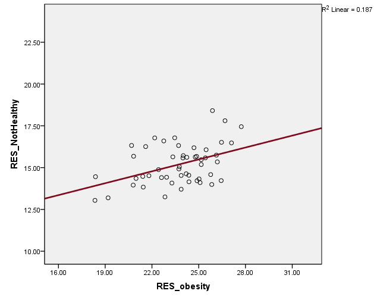

<!-- This video is part 3 of the lecture on the basic model of multiple linear
regression. -->

## Control of Confounding Factors

Why isn’t it enough to do a set of bivariate analysis of relationships between
the variable of interest and its “factors”?

<!--
Multivariate analysis can help us to investigate relationships among three
or more variables in various ways, and one of the most important among them
is control of confounding factors. Suppose, that we are interested in a
variable and there are a number of factors that may affect the variable of
interest. Then, we can look at the statistical relation between the
variable of interest and each of its factors, one by one. That will be a
set of separate bivariate analyses. Isn't s such a set of bivariate
analyses enough? Why do we need to analyze effects of multiple factors
together?
-->

## Control of Confounding Factors in Experimental Research

We want to study relationships between X and Y, independently of effects of
some other variables on Y.

Example:
* $X$ some medication (and placebo);
* $Y$ some physiological condition
* $X - Y$ relation may be confounded by some other factors (gender, age, other
demographic, social, and economic characteristics, life styles, and other
physiological characteristics such as BMI)

<!--
Suppose, we focus on one of the factors, so we want to study relationship
between the factor, let's denote it as 'X', and the variable of interest, let's
denote it as 'Y'. We want to study the relationships between X and Y,
independently of effects of other factors. For example, suppose we are doing
some pharmacological research, and we are interested in  effects of a
medication on some physiological condition. So we may get a number of study
participants, split them into two groups, and give the medication to one of the
two groups, and a placebo, which looks like a medication but has nothing
special, to the other group. We may call the first group, the experimental
group, and the second group, the control group. Then, we may want to follow the
physiological condition of those in the experimental and control groups through
the experiment. But suppose, people in the experimental group are mostly women,
and people in the control group are mostly men. Then, differences between the
two groups may reflect, both, effects of the medication, and gender differences
in the physiological condition. Or suppose people in the experimental group are
mostly old persons and those in the control group of mostly young persons.
Then, observed physiological differences between the two groups, may reflect,
both, effects of the medication, and age differences in the physiological
condition. Other characteristics may matter. What if those in the experimental
group are mostly smokers, and those in the control group are non-smokers? In
these cases, effects of the medication may be statistically confounded by some
other factors, such as gender, age, smoking, etc.
-->

## Control of Confounding Factors in Experimental Research

How do we control those confounding factors in experimental research?

1. **Blocking** (block design): Making  the compositions of experimental groups
comparable in terms of some key, identifiable characteristics.
2. **Randomization**: Decreasing the likelihood for the compositions of
experimental groups differ significantly in terms of some relevant
characteristics.

<!--
How do we control those confounding factors in experimental research? Usually
two methods are used together. One is blocking or block design. For example, if
the study participants include eight women in the 40s, we assign four of them
to the experimental group, and the other four to the control group. In this
way, we can make the two groups have similar compositions, in terms of some
important identifiable characteristics such as gender and age. Then, instead of
letting those women choose their group by themselves, we randomly assign four
of them to the experimental group, and the other four to the control group.
Since we don't know every characteristic of the study participants, we cannot
make the two group similar with respect to those unknown characteristics, but
we expect that this random assignment will reduce the risk of having a very
uneven distribution of some characteristics between the two groups.
-->

## Control of Confounding Factors in Observational Research

Experimental control is ethically, technically, or financially
impossible/difficult in many cases.  -> Observational research

In observational research, we control confounding factors by statistical
manipulation of data (i.e., regression analysis).

<!--
Blocking and randomization are useful tools for controlling confounding factors
in experimental research. But in many cases, experimental control is ethically,
technically, or financially impossible or difficult. For example, suppose we
are doing a study on health outcomes of cigarette smoking. But since many
detrimental effects of smoking on health have already been found, we should not
and cannot ask a group of people to smoke cigarettes for the next few years. So
we have to depend on observational research, in such a case. Data from those
who smoke and those who do not smoke, are collected and health conditions of
the two groups are compared. But smokers and non-smokers probably have
different distributions with respect to some characteristics, which may have
some health effects. So in observational research, it is important to control
confounding factors. In observational research, since we cannot use
experimental control, we control confounding factors by statistical
manipulation of data, such as multiple linear regression. Usually it is not as
effective as experimental control, but still it helps.
-->

## Example A: H&G paper

Background: Osteoporosis in old age (particularly among postmenopausal women)

Public health relevance: Prevention of osteoporosis by dietary means

BMD: numerical variables

Other factors -> Multiple regression

<!--
In this section, we briefly go through a research paper, which is a reading
assignment for this session. The authors, Hall and Greendale, provide us with a
typical example of use of multiple linear regression in health research. The
researchers are concerned about osteoporosis, which is a serious health problem
in the aging society. In many old persons, particularly in old women, bone
density tends to decline with age, raising the risk of fracture and other
health problems. The authors are pursuing prevention of osteoporosis by dietary
means, and have hypothesized that vitamin C consumption should raise bone
density, and reduce the risk of osteoporosis. So they investigated the
relationships between bone mineral density, here abbreviated as B-M-D, and
factors, including vitamin C consumption, that may affect bone density. Since
bone density is a numerical variable, measured in grams per centimeter squared,
multiple linear regression is considered a suitable tool for this research
question.
-->

## Example A: H&G paper {.smaller}

* $Y$s
    * Femoral neck BMD
    * Total hip BMD
    * Mean spine BMD
* $X$s
    * Vitamin C
    * Age
    * BMI
    * Postmenopausal estrogen therapy
    * Caloric intake
    * Calcium intake
    * Leisure physical activity
    * Smoking history

<!--
The dependent variable of this regression analysis is bone density, which is
not one variable, because bone density can be measured at different sites in
the body. In this study, bone density was measured at three sites: the femoral
neck, hip, and spine. The femoral neck is the top of the bone of the leg
between the pelvis and knee. This analysis included vitamin C consumption and
some other variables, which are considered to be possible determinants of bone
density. The data were collected from 775 postmenopausal women between 45 and
64 of age.
-->

## Regression of BMD on Vitamin C and Other Variables


<!--
The researchers adopted three different regression models for each of the three
sites, shown in the leftmost column of this table. So in total, nine regression
analyses were done. The results are summarized in this table. The column titled
predictor variables, show independent variables of each regression analysis. As
shown there, all of the models included vitamin C, as an independent variable.
The column titled beta coefficient, displays the estimated values of the
regression coefficient for vitamin C.. The rightmost columns show p-value and
'R' squared, which we will study in sessions 5 and 4.
-->

## Regression of Femoral Neck BMD on Vitamin C and Other Variables

<div class="columns-2">
$X$s

$B$ for Vitamin C
<div>


<!--
As shown in this slide, first, they did simple linear regression of bone
density on vitamin C only, and then regression on vitamin C, age, and BMI
together, and finally they included all of those eight factors. Estimated
values of regression coefficient for vitamin C from regression of bone density
at the femoral neck, are shown here: 0.015, 0.018, and 0.017. The unit of
analysis of vitamin C consumption, is 100 milligram per day. So, 0.015 means an
increase in bone density by 0.015 gram per squared centimeter, corresponds to
an increase of daily consumption of vitamin C by 100 milligram. Considering the
units of bone density and vitamin C used in this analysis, these values do not
seem to indicate very strong effects. But these values are all positive, which
means (women who consume more vitamin C) tend to have higher levels of bone
density at the femoral neck. These values are statistically significant,
according to the regular standards. So it can be considered that the results
are consistent with the hypothesis of the researchers, i.e., vitamin C
consumption has positive effect on the bone density of postmenopausal woman.
-->

## Regression Models

$BMD = A + B_{1}VC + E$

$BMD = A + B_{1}VC + B_{2}AGE + B_{3}BMI + E$

$BMD = A + B_{1}VC + B_{2}AGE + B_{3}BMI + B_{4}PET + \dots + E$

$B_{1}$ for femoral neck BMD: 0.015 -> 0.018 -> 0.017

<!--
The three regression models are shown here in the equation form. (A) is the
constant, (VC) is vitamin C consumption, and B1 is the regression coefficient
for vitamin C.. For bone density at the femoral neck, the value of B1 changed
from 0.015, to 0.018, and to 0.017. So the value of B1 did not change very
much, when more factors were added to the model. This may suggest that vitamin
C consumption may not be strongly correlated with those factors.
-->

## Example B: Healthy States

For each of 50 States and DC:

* NotHealthy: % who reported their health condition as fair or poor.
* Obesity: % BMI >= 30, 2003-2005 (20+, age-adjusted, self-reported, BRFSS)
* HighSchool: % those who have completed high school 2005 (25+, including equivalency)
* Smoking: % currently smoking, 2003-2005 (18+, age-adjusted)
* Insurance: % not covered by health insurance, 2003-2005 (18-64)

<!--
Let's look at another example, which is actually the software example for this
session. I recommend that you view this section, after going through the
software example. In this data, the unit of analysis is not a person but a U-S
state.  The data set consists of five variables for 50 U-S states and the
District of Columbia. The names of the five variables are: not healthy,
obesity, high school, smoking, and insurance. Not healthy is the percent of
adults in the state, who reported their health condition as fair, or poor,
instead of excellent, very good, or good. Obesity is the percent of adults
whose BMI is 30 or over. High school is the percent of adults who have
completed high school education. Smoking is the percent of adults who are
currently smoking. And insurance is the percent of adults who are not covered
by health insurance. The data sources are B-R-F-S-S, behavioral risk factor
surveillance system, and census based estimates. Values for those variables
indicate conditions at some time between year 2003 and 2005.  We examined
whether states that have higher proportions of obese adults, tend to have
higher proportions of adults who are self reportedly unhealthy. It should be
noted that, since this is aggregated-level data, not individual-level data, we
did not examine whether obese adults tend to be self reportedly unhealthy. That
research question should be investigated with individual-level data.
-->

## Example B: Healthy States

```{r,echo=FALSE,results="hide"}
health_state <- haven::read_sas("../data/health_state.sas7bdat")
fit <- lm(NotHealthy ~ Obesity, data = health_state)
f1 <- round(coef(fit), 2)
fit2 <- lm(NotHealthy ~ Obesity + HighSchool + Smoking + Insurance,
    data = health_state)
f2 <- round(coef(fit2), 2)
```

$Y = `r f1[[1]]` + `r f1[[2]]`X_{1} + E$

$Y = `r f2[[1]]` + `r f2[[2]]`X_{1} - `r f2[[3]]`X_{2} + `r f2[[4]]`X_{3} + `r f2[[5]]`X_{4} + E$

* Y: NotHealthy
* X1: Obesity
* X2: HighSchool
* X3: Smoking
* X4: Insurance

<!--
First, we did simple linear regression of not healthy on obesity, and then
multiple linear regression of not healthy on obesity, high school, smoking, and
insurance, together. The estimated regression equations are shown here.  The
coefficient for obesity in the simple regression was 0.76. It means that, the
typical pattern of relation between obesity and not healthy in the data is, if
the proportion of adults who are obese increases by 1 percentage point, then
the proportion not being healthy increases by 0.76 percentage point. If we
prefer to use larger numbers, we can also say, if the proportion of adults who
are obese increases by 10 percentage point, then the proportion of adults not
being healthy being self reportedly unhealthy increases 7.6 percentage points.
This seems a fairly strong relation.  However, both of these two variables are
correlated with the other three variables. Multiple linear regression
incorporated the information on these correlations, and makes it possible to
estimate what the relation between not healthy and obesity would be, if we
could compare U-S states that have the same proportion of adults who have
graduated from high school, the same proportion of adults's who are currently
smoking, and the same proportion of adults who are not covered by health
insurance. It was estimated that, in the hypothetical situation, if the
proportion of adults who are obese, increases by 10 percentage points, then the
proportion of adults who are self reportedly unhealthy, increases by about 2.4
percentage points. This is what the estimated value of partial regression
coefficient for obesity, 0.24, means.
-->

## Decomposition of B


<!--
The regression results can be represented schematically, as in the next two
slides. The coefficient for obesity in the simple regression was 0.76. This
value represents the typical pattern of relation between not healthy and
obesity, thereby summarizing the association between the two variables in the
data. With three additional variables, high school, smoking, and insurance, the
association between not healthy and obesity can be decomposed into four
components: the association between not healthy and obesity through their
relations to high school, the association between not healthy and obesity
through their relations to smoking, the association between not healthy and
obesity through their relations to insurance, and the association between not
healthy and obesity controlling for high school, smoking, and insurance, i.e.,
what the association between not healthy and obesity would be, if they are
compared among U-S states that have the same values for high school, smoking,
and insurance.
-->

## Decomposition of B


<!--
This slide shows results of the decomposition using a method called path
analysis. Through high school, an increase in not healthy by 0.346 percentage
points, corresponds to one percentage point increase in obesity. Through
smoking, an increase in not healthy by 0.062 percentage points, corresponds to
one percentage point increase in obesity. Through insurance, an increase in not
healthy by 0.114 percentage points, corresponds to one percentage point
increase in obesity. And if we compare not healthy and obesity among U-S states
that have the same values for high school, smoking, and insurance, then we
would find that an increase in not healthy by 0.237 percentage points,
corresponds to one percentage point increase in obesity. And in total, an
increase in not healthy by 0.759 percentage points, corresponds to one
percentage point increase in obesity. Note that these four numbers, 0.346,
0.062, 0.114, and 0.237, add up to 0.759.
-->

## Regression

$B = 0.759$

```{r,echo=FALSE}
with(health_state, plot(Obesity, NotHealthy, xlab = "Obese (%)",
    ylab = "In Fair/Poor Health Status (%)"))
abline(lm(NotHealthy ~ Obesity, data = health_state), lwd = 3, col = "red")
```

<!--
This is a plot of not healthy by obesity, i.e., the percent of adults who are
self reportedly unhealthy, by the percent of adults who are obese, in the
original data. Each circle represents a U-S state or DC. The red line is the
regression model fitted to this data, and its slope is 0.759, meaning the
typical pattern of association between the two variables is, an increase in not
healthy by 0.759 percentage point, corresponds to one percentage point increase
in obesity.
-->

## Regression

$B = 0.237$



<!--
This plot shows what the relation between not healthy and obesity would look
like, if 50 U-S states and DC had the same proportions of adults who have
graduated from high school, who are currently smoking, and who are not covered
by health insurance. In a later session of this course, we will study how to
produce this plot, but it will be close to the end of the course.  This is not
original data themselves, but a hypothetical pattern which was estimated, by
fitting the multiple linear regression model to the data. The slope of the
regression line is now 0.237, which is less steep than the slope of the
regression line in the previous slide. The association between the two
variables appeared stronger in the previous slide, but the differences between
the two plots are due to the fact that both of them are associated with high
school, smoking, and insurance-->

## Next week

* Categorical variables in linear regression

<!-- Next week we will talk about how to use and interpret categorical
variables in a linear regression. -->
